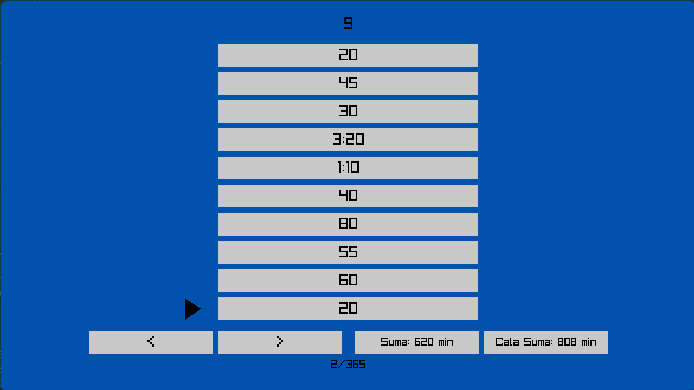

# Zeitcalc

> WARNING  
> Still in 'TODO' state. Not all features I would like to have are implemented yet.

Small GUI program for calculating time.  
Originally made for an assignment for high school, but might I make it something greater in future.

  

